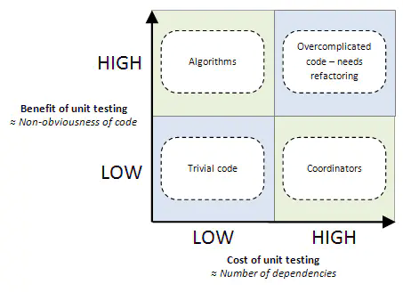

## TEST

**Reference**
1. [Golang项目的测试实践](https://studygolang.com/articles/20602)
2. [Golang mock 框架实践](https://blog.csdn.net/baijiwei/article/details/82525964)
3. [GoMock框架使用指南](https://www.jianshu.com/p/f4e773a1b11f)
4. [搞定Go单元测试（一）—— 基础原理](https://juejin.im/post/6844903853528186894)
5. [搞定Go单元测试（二）—— mock框架(gomock)](https://juejin.im/post/6844903853532381198)
6. [搞定Go单元测试（三）—— 断言(testify)](https://juejin.im/post/6844903853532397581)
7. [搞定Go单元测试（四）—— 依赖注入框架(wire)](https://juejin.im/post/6844903853536575501)
8. [Selective Unit Testing – Costs and Benefits](http://blog.stevensanderson.com/2009/11/04/selective-unit-testing-costs-and-benefits/)

---

---

在Go语言中，可以这样描述Mock和Stub：
- Mock：在测试包中创建一个结构体，满足某个外部依赖的接口 interface{}
- Stub：在测试包中创建一个模拟方法，用于替换生成代码中的方法

---

### Costs and Benefits

在受益于单元测试的好处的同时，也必然增加了代码量以及维护成本（单元测试代码也是要维护的）。下面这张成本/价值象限图很清晰的阐述了在不同性质的系统中单元测试成本和价值之间的关系。

1. 依赖很少的简单的代码(左下)
对于外部依赖少，代码又简单的代码。自然其成本和价值都是比较低的。举Go官方库里errors包为例，整个包就两个方法 New()和 Error()，没有任何外部依赖，代码也很简单，所以其单元测试起来也是相当方便。
2. 依赖较多但是很简单的代码（右下）
依赖一多，mock和stub就必然增多，单元测试的成本也就随之增加。但代码又如此简单（比如上述errors包的例子），这个时候写单元测试的成本已经大于其价值，还不如不写单元测试。
3. 依赖很少的复杂代码 (左上)
像这一类代码，是最有价值写单元测试的。比如一些独立的复杂算法（银行利息计算，保险费率计算，TCP协议解析等），像这一类代码外部依赖很少，但却很容易出错，如果没有单元测试，几乎不能保证代码质量。
4. 依赖很多又很复杂（右上）
这种代码显然是单元测试的噩梦。写单元测试吧，代价高昂；不写单元测试吧，风险太高。像这种代码我们尽量在设计上将其分为两部分：1.处理复杂的逻辑部分 2.处理依赖部分 然后1部分进行单元测试

---
