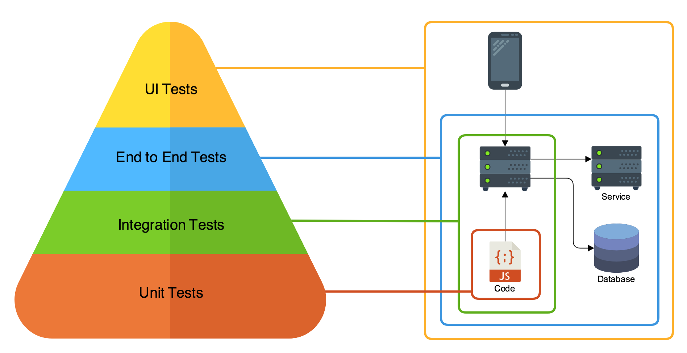

## TEST

**Reference**
1. [Golang项目的测试实践](https://studygolang.com/articles/20602)
2. [Golang mock 框架实践](https://blog.csdn.net/baijiwei/article/details/82525964)
3. [GoMock框架使用指南](https://www.jianshu.com/p/f4e773a1b11f)
4. [搞定Go单元测试（一）—— 基础原理](https://juejin.im/post/6844903853528186894)
5. [搞定Go单元测试（二）—— mock框架(gomock)](https://juejin.im/post/6844903853532381198)
6. [搞定Go单元测试（三）—— 断言(testify)](https://juejin.im/post/6844903853532397581)
7. [搞定Go单元测试（四）—— 依赖注入框架(wire)](https://juejin.im/post/6844903853536575501)

---

---

在Go语言中，可以这样描述Mock和Stub：
- Mock：在测试包中创建一个结构体，满足某个外部依赖的接口 interface{}
- Stub：在测试包中创建一个模拟方法，用于替换生成代码中的方法
